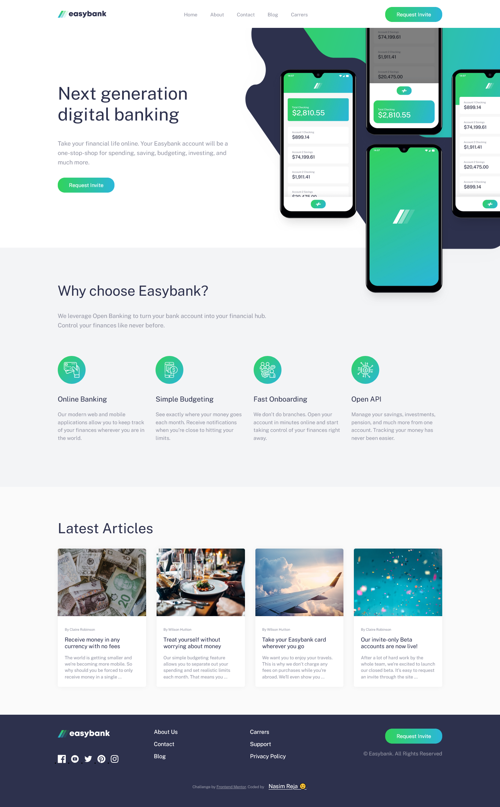

# Frontend Mentor - Easybank landing page solution

This is a solution to the [Easybank landing page challenge on Frontend Mentor](https://www.frontendmentor.io/challenges/easybank-landing-page-WaUhkoDN). Frontend Mentor challenges help you improve your coding skills by building realistic projects.

## Table of contents

- [Overview](#overview)
  - [The challenge](#the-challenge)
  - [Screenshot](#screenshot)
  - [Links](#links)
  - [Built with](#built-with)
  - [What I learned](#what-i-learned)
  - [Continued development](#continued-development)
  - [Useful resources](#useful-resources)
- [Author](#author)

## Overview

-- This is a practice project- easybank landing page

### The challenge

Users should be able to:

- View the optimal layout for the site depending on their device's screen size
- See hover states for all interactive elements on the page

### Screenshot



### Links

- Solution URL: [Github Repo](https://github.com/nasim67reja/easyBank.github.io)
- Live Site URL: [Live Link](https://nasim67reja.github.io/easyBank.github.io/)

### Built with

- Semantic HTML5 markup
- CSS custom properties
- Flexbox
- CSS Grid
- Desktop-first workflow
- Vanila JavaScript

### What I learned

By building this project , I have learned a new event call resize. The most important and hard part of the project was the hero section specially the svg background.
working with svg background was so tough for me.Use svg in my html file was different and first time for me.After all it was an easy task for me

```html
<svg>
  <use href="#facebook"></use>
</svg>
```

```js
const header = document.querySelector(".container");
const hero = document.querySelector(".hero");

function reportWindowSize() {
  hero.style.marginLeft = getComputedStyle(header)["margin-left"];
}
reportWindowSize();
window.addEventListener("resize", reportWindowSize);
// sticky Navigation
const section1 = document.querySelector("#section1");
const mainHeader = document.querySelector(".header");

const initialCoords = section1.getBoundingClientRect();

window.addEventListener("scroll", function () {
  if (window.scrollY > initialCoords.top) {
    mainHeader.classList.add("sticky");
  } else mainHeader.classList.remove("sticky");
});
```

### Continued development

I think I need to more focus on responsive svg background

### Useful resources

- [Example resource 1](https://github.com/jonasschmedtmann/complete-javascript-course/blob/master/13-Advanced-DOM-Bankist/final/script.js) - This helped me for understand the event delegation and the tab component and slider.

## Author

- Website - [Nasim Reja](https://www.your-site.com)
- Frontend Mentor - [@nasim67reja](https://www.frontendmentor.io/profile/@nasim67reja)
- Twitter - [@Nasimreja97](https://www.twitter.com/@Nasimreja97)
